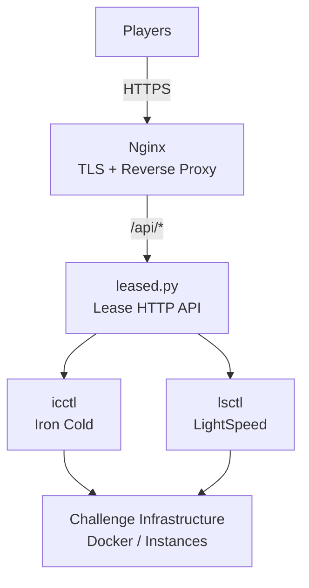

# Self-Service Lease Service

HTTP self-service provisioning layer for BPCTF2 challenge infrastructure.

This directory contains the player-facing lease interface and the backend that converts lease requests into calls to the underlying challenge infrastructure control utilities.

It supports both:

- Iron Cold
- LightSpeed

The same backend implementation is used for both modes.

## Architecture



## Components

```text
lease-selfserve/
├── README.md
├── DEPLOY.md
├── leased.py
├── leased.service.template
├── lease.html
└── lease-lightspeed.html
```

### `leased.py`

The backend HTTP service.

It uses Python's standard library HTTP server and does not require Flask or another web framework.

The service listens only on:

```text
127.0.0.1:8088
```

It is intended to sit behind nginx.

### `lease.html`

Static player-facing lease request page.

The page submits a team name to:

```text
POST /api/lease
```

### `lease-lightspeed.html`

LightSpeed-specific player-facing lease page.

### `leased.service.template`

systemd service template used to run the backend.

### `DEPLOY.md`

Deployment and operational notes for the production environment.

## Request Flow

A player submits a team name through the web interface.

```text
Player
  │
  │ HTTPS
  ▼
Nginx
  │
  │ /api/lease
  ▼
leased.py
  │
  ├── Validate request
  │
  ├── Determine source IP
  │
  ├── Apply rate limits
  │
  ├── Check existing lease
  │
  └── Create lease if necessary
          │
          ▼
     icctl / lsctl
          │
          ▼
    Challenge instance
```

## API

### `GET /api/health`

Returns the service health state.

Example:

```json
{
  "status": "ok",
  "mode": "lightspeed"
}
```

The mode is determined by:

```text
LEASED_MODE
```

### `POST /api/lease`

Creates or retrieves a lease for a team.

Request:

```json
{
  "team": "Example Team"
}
```

The request body must be valid JSON.

The backend rejects empty or oversized request bodies and malformed JSON.

## Team Name Validation

Team names must match:

```text
^[A-Za-z0-9][A-Za-z0-9 _.\-]{0,47}$
```

This means the team name:

- Must begin with a letter or digit
- Can contain letters
- Can contain digits
- Can contain spaces
- Can contain `_`
- Can contain `.`
- Can contain `-`
- Has a maximum length of 48 characters

## Idempotency

Lease requests are intentionally idempotent for an existing team.

The backend first performs:

```text
show <team>
```

before attempting:

```text
lease <team>
```

If an existing lease is found, the backend returns it immediately.

Response:

```json
{
  "address": "...",
  "status": "existing"
}
```

This behavior is particularly important during slow provisioning.

For example:

```text
Player request
      │
      ▼
Server starts provisioning
      │
      │ 10–25 seconds
      │
      ├── Client times out
      │
      ▼
Player submits same team again
      │
      ▼
show <team>
      │
      ▼
Existing lease found
      │
      ▼
Return existing allocation
```

The second request does not create another instance.

## New Lease

If no existing lease is found, the service executes the configured control utility:

```text
<ctl> lease "<team>"
```

On success, the output is parsed according to the configured mode.

### Iron Cold

The backend looks for:

```text
Target: <address>
```

The API returns:

```json
{
  "address": "...",
  "status": "created"
}
```

### LightSpeed

The backend looks for:

```text
gRPC: <address>
Token: <token>
```

The API returns:

```json
{
  "address": "...",
  "token": "...",
  "status": "created"
}
```

## Failure Handling

The backend distinguishes several infrastructure states.

### Existing Lease

Returns the existing lease with HTTP `200`.

### Already Had a Lease

If the underlying control utility reports that the team already used its lease but no active allocation can be returned, the service returns a conflict response.

### Mid-Operation

If provisioning is already occurring, the backend returns a temporary failure response instructing the client to wait and retry.

### Pool Exhaustion

If the infrastructure reports that the pool is full or there are no free slots, the service returns a temporary failure.

### Provisioning Failure

Unexpected infrastructure errors produce an HTTP `500` response.

The backend includes limited diagnostic information from the control utility output for organizer troubleshooting.

### Invalid Request

Malformed JSON, invalid team names, or invalid request sizes are rejected before infrastructure operations are invoked.

## Rate Limiting

The service implements two independent per-IP controls.

### Distinct Team Limit

A source IP can claim at most:

```text
5 distinct team names / hour
```

This is controlled by:

```python
MAX_NEW_TEAMS_PER_IP = 5
WINDOW_SECONDS = 3600
```

The purpose is to prevent one visitor from rapidly consuming the entire lease pool using fabricated team names.

### General Request Limit

A source IP can make at most:

```text
12 requests / minute
```

Controlled by:

```python
MAX_REQUESTS_PER_IP_PER_MIN = 12
```

This limits simple request hammering.

### Existing Team Requests

Repeated requests for a team already seen from the IP do not count as new distinct-team claims.

This allows players to safely re-submit their own team name if the first provisioning request took too long.

## Rate-Limit State

The service keeps rate-limit state in process memory.

The implementation maintains:

```text
_new_team_log
_req_log
_known_teams_per_ip
```

Access to these structures is protected by a threading lock.

Because this state is process-local, restarting the service resets the in-memory rate-limit state.

## Authentication Model

There is deliberately no authentication mechanism beyond the submitted team name.

This was an operational decision made because the event had already started when the self-service system was introduced.

Pre-issued team claim codes could not be distributed conveniently at that stage.

The trade-off is that the system cannot independently prove that a player actually belongs to the supplied team.

The mitigation is:

```text
5 distinct team names / IP / hour
+
12 requests / IP / minute
+
idempotent allocation
+
organizer-side infrastructure controls
```

The accepted limitation is that a user could still claim a lease using another team's name.

If abuse occurs, the intended operational response is to quarantine the affected infrastructure slot through the underlying control utility.

## Backend Configuration

The backend uses environment variables.

### `LEASED_CTL`

Path to the infrastructure control utility.

Example:

```text
LEASED_CTL=/opt/leased/icctl
```

or:

```text
LEASED_CTL=/opt/leased/lsctl
```

### `LEASED_MODE`

Required mode.

Supported values:

```text
ironcold
lightspeed
```

### `LEASED_PORT`

HTTP listening port.

Default:

```text
8088
```

### `LEASED_SUDO`

Controls whether the backend prefixes control utility calls with `sudo`.

Default:

```text
1
```

The production systemd template uses:

```text
LEASED_SUDO=0
```

because the service itself runs as root.

## systemd

The service is designed to run under systemd.

The service template configures:

```text
After=network.target
```

and:

```text
Restart=always
RestartSec=2
```

The backend is launched with:

```text
/usr/bin/python3 /opt/leased/leased.py
```

The production service runs as:

```text
User=root
```

because the underlying control utilities require the privileges necessary to manage Docker infrastructure.

## Network Exposure

`leased.py` binds only to:

```text
127.0.0.1
```

It should not be directly reachable from the public internet.

Nginx provides the public HTTPS endpoint and proxies API requests internally.

```text
Internet
   │
   │ HTTPS
   ▼
Nginx
   │
   │ /api/*
   ▼
127.0.0.1:8088
   │
   ▼
leased.py
```

This keeps the Python service off the public network and allows nginx to handle TLS.

## Frontend Deployment

The static lease pages are served by nginx.

The backend receives API requests through:

```text
/api/*
```

The deployment uses a mode-specific static page.

The `lease.html` template uses a mode value in the document's `data-mode` attribute.

During deployment, the placeholder:

```text
__MODE__
```

is replaced with the appropriate deployment mode.

For example:

```text
__MODE__ → ironcold
```

or:

```text
__MODE__ → lightspeed
```

## Production Deployment

The production deployments were hosted on Google Compute Engine VMs.

The VMs were placed in:

```text
GCP project:
breachpoint-overflow-15140

Zone:
us-central1-a
```

SSH access used Google Cloud IAP rather than exposing SSH directly.

## Redeployment

After modifying `leased.py`, the production service can be updated by copying the file to the VM and restarting systemd.

```bash
gcloud compute scp leased.py <vm>:~/leased.py \
  --zone=us-central1-a \
  --project=breachpoint-overflow-15140 \
  --tunnel-through-iap
```

Then:

```bash
gcloud compute ssh <vm> \
  --zone=us-central1-a \
  --project=breachpoint-overflow-15140 \
  --tunnel-through-iap \
  --command='sudo cp ~/leased.py /opt/leased/leased.py && sudo systemctl restart leased'
```

## Operational Timing

A normal cold provisioning operation can take:

```text
10–25 seconds
```

The delay comes from the underlying challenge infrastructure provisioning, including Docker Compose startup.

The frontend should therefore allow the request to remain pending.

Do not interpret a client-side timeout as proof that provisioning failed.

The correct recovery procedure is to submit the exact same team name again.

Because lease creation is idempotent, the backend will return the existing allocation if the original operation completed successfully.

## Production URLs

The BPCTF2 deployment exposed separate self-service pages for the two challenge environments:

```text
https://ironcold.breachpoint.live/lease.html
https://lightspeed.breachpoint.live/lease.html
```

## Design Goals

The self-service layer was designed around several operational requirements:

1. Remove repetitive manual provisioning work from organizers.
2. Allow players to obtain challenge infrastructure themselves.
3. Prevent duplicate allocations.
4. Limit abuse without requiring a complete authentication system.
5. Keep challenge-specific provisioning logic outside the HTTP service.
6. Support both Iron Cold and LightSpeed through the same backend.
7. Handle slow infrastructure provisioning gracefully.
8. Provide a small, dependency-free backend suitable for deployment on the challenge VMs.

## Why the Backend Uses the Standard Library

`leased.py` intentionally does not depend on Flask, FastAPI, or another external Python framework.

The implementation uses:

```text
http.server
json
os
re
subprocess
threading
time
```

This minimizes deployment dependencies for a small infrastructure control service.

The backend can therefore be deployed using the system Python installation without maintaining a separate Python application environment.

## Operational Boundary

The self-service service is intentionally thin.

It owns:

```text
HTTP API
Request validation
Rate limiting
Idempotency
Control utility invocation
Output parsing
HTTP responses
```

It does not own:

```text
Docker orchestration
Challenge application logic
Instance implementation
Datastore implementation
Challenge images
Underlying infrastructure lifecycle
```

Those responsibilities remain with `icctl` and `lsctl`.

## Repository Role

```text
lease-selfserve/
├── README.md
├── DEPLOY.md
├── leased.py
├── leased.service.template
├── lease.html
└── lease-lightspeed.html
```

This directory is the self-service/control-plane layer of the BPCTF2 Lease Manager.

The parent repository contains the complete production implementation, while this directory specifically documents the HTTP-facing provisioning service.
